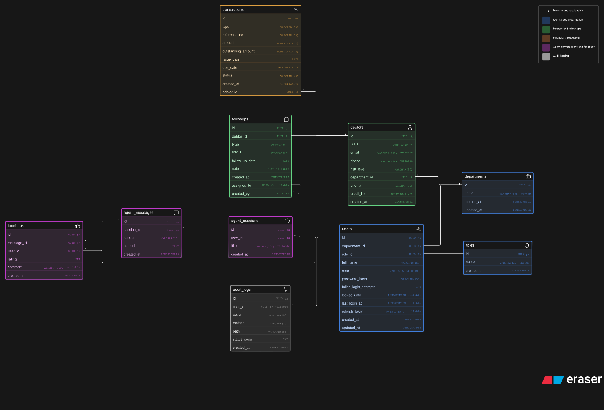

# HEMRAJ AI — Finance / Debtor Agent Backend

Backend service built for the Hemraj AI project.

The project focuses on the backend foundation behind a Finance / Debtor Agent: authentication, department-based access control, debtor and transaction data, natural-language agent queries, conversation history, follow-ups, feedback, audit logs, Redis, and a small real-time capability.

> Backend only. No frontend or UI

## What this project does

An employee logs in and receives an access token and refresh token through secure HTTP-only cookies. Every protected request is authenticated on the server, and access is also checked against the employee's role and department.

For finance operations, the API can search and filter debtors by name, email, phone, risk level, priority, creation date, and minimum ageing days. Transaction history supports additional filters, pagination, and sorting.

The Agent API adds a natural-language layer on top of the same backend data. Gemini is used to understand a supported request, convert it into structured filters, run the normal PostgreSQL query, and then turn the returned records into a short answer.

The application keeps responsibilities separated as:

```text
Routes -> Middleware -> Controller -> Repository -> PostgreSQL/Redis
                                      |
                                      +-> Agent service (Gemini)
```

## Tech stack

- TypeScript
- Node.js runtime: Bun
- Express 5
- PostgreSQL 16
- Redis 7
- Socket.IO
- JWT
- bcrypt
- Zod
- LangChain + Google Gemini
- Winston
- Docker / Docker Compose

The database layer uses parameterized PostgreSQL queries directly with `pg`. Prisma was listed in the preferred stack, but raw SQL was used here so that the assessment's query and data-access logic stays explicit and easy to review.

## Project structure

```text
## Project structure

.
├── .dockerignore                # Docker build exclusions
├── .env.example                 # Example environment configuration
├── .gitignore                   # Git exclusions for secrets, logs, dependencies, etc.
├── Dockerfile                   # API container configuration
├── docker-compose.yml           # API, PostgreSQL and Redis services
├── package.json                 # Project scripts and dependencies
├── bun.lock                     # Locked dependency versions
├── README.md                    # Project documentation
├── er.svg                       # Database ER diagram
├── Hemraj_AI_API.postman_collection.json  # API collection for testing
│
├── migrations/                  # PostgreSQL schema, constraints and indexes
│
└── src/
    ├── config/                 # Environment, database, Redis, CORS and cookie config
    ├── controllers/            # Request handling and response logic
    ├── errors/                 # Custom application errors
    ├── lib/                    # Shared utilities such as logging
    ├── middleware/             # Authentication, authorization, validation, rate limiting and errors
    ├── repositories/           # PostgreSQL queries and data access
    ├── routes/                 # API route definitions
    ├── scripts/                # Database migration scripts
    ├── seed/                   # Demo data seed scripts
    ├── services/               # Agent and Gemini-related business logic
    ├── utils/                  # JWT, password, Redis and other helpers
    ├── validator/              # Zod request validation schemas
    └── socket.ts               # Socket.IO real-time events

```

## Database design

The relational model is centered around employees, departments, debtors, transactions, agent sessions, follow-ups, feedback, and audit logs.

Main relationships:

- A department has many users and debtors.
- A role is assigned to many users.
- A debtor has many transactions.
- A user can have many agent sessions.
- A session contains many agent messages.
- A debtor can have many follow-ups.
- A follow-up can be assigned to a user and records who created it.
- Feedback belongs to an agent message and the user who submitted it.
- Audit logs record authenticated API activity.

### ER diagram



## Authentication and authorization

### Authentication flow

```text
Login
  -> validate credentials
  -> bcrypt password check
  -> failed-attempt / lock check
  -> create access + refresh JWT
  -> store refresh token
  -> send tokens as HTTP-only cookies
```

The refresh flow verifies the refresh JWT and also compares it with the refresh token stored for that user. A new access token and refresh token are issued when the refresh succeeds.

Logout clears the stored refresh token and both cookies.

### Roles

The application has three roles:

| Role      | Access model                                                                           |
| --------- | -------------------------------------------------------------------------------------- |
| `admin`   | Full access across departments                                                         |
| `manager` | Access limited to their department                                                     |
| `agent`   | Access limited to their own department, with tighter rules for sessions and follow-ups |

Authorization is enforced on the backend. It is not based on anything sent by a frontend.

Examples:

- A manager cannot read debtors from another department.
- An agent can only read their own agent sessions.
- A manager can only read sessions from their department.
- An agent can only update follow-ups assigned to them.
- A manager can assign follow-ups only to agents in their department.
- Feedback is checked against the related session before it is accepted.

The current implementation uses role-based checks.

## API endpoints

Base URL:

```text
http://localhost:8080/api
```

### Authentication

| Method | Endpoint         | Auth                 |
| ------ | ---------------- | -------------------- |
| POST   | `/auth/register` | Public               |
| POST   | `/auth/login`    | Public               |
| POST   | `/auth/refresh`  | Refresh cookie/token |
| POST   | `/auth/logout`   | Authenticated        |
| GET    | `/auth/profile`  | Authenticated        |

### Debtor / finance APIs

| Method | Endpoint                    | Auth                    |
| ------ | --------------------------- | ----------------------- |
| GET    | `/debtors`                  | Admin / Manager / Agent |
| GET    | `/debtors/:id`              | Admin / Manager / Agent |
| GET    | `/debtors/:id/transactions` | Admin / Manager / Agent |

`GET /debtors` supports:

```text
search
riskLevel
priority
dateFrom
dateTo
minAgeingDays
page
limit
```

`GET /debtors/:id/transactions` supports:

```text
type
status
dateFrom
dateTo
minAgeingDays
sortBy
sortOrder
page
limit
```

### Agent and sessions

| Method | Endpoint        | Auth                    |
| ------ | --------------- | ----------------------- |
| POST   | `/agent/query`  | Admin / Manager / Agent |
| GET    | `/sessions/:id` | Admin / Manager / Agent |

Example:

```http
POST /api/agent/query
Content-Type: application/json

{
  "query": "Show high risk debtors above 90 days ageing"
}
```

The agent layer converts that request into structured filters such as:

```json
{
  "intent": "get_debtors",
  "filters": {
    "riskLevel": "high",
    "minAgeingDays": 90
  }
}
```

The actual department restriction still comes from the authenticated employee. The LLM cannot choose or override the department.

Example response shape:

```json
{
  "success": true,
  "message": "Agent query processed",
  "data": {
    "sessionId": "...",
    "answer": "Global Traders has a critical risk level with ...",
    "messageId": "..."
  }
}
```

Only supported debtor-search/filtering requests are currently handled by the Agent API. Unsupported requests return a short capability message instead of inventing an answer.

### Follow-ups

| Method | Endpoint         | Auth                    |
| ------ | ---------------- | ----------------------- |
| POST   | `/followups`     | Admin / Manager / Agent |
| GET    | `/followups`     | Admin / Manager / Agent |
| PATCH  | `/followups/:id` | Admin / Manager / Agent |

Duplicate follow-ups are checked using:

```text
debtor + assigned user + type + follow-up date
```

### Feedback

| Method | Endpoint    | Auth                    |
| ------ | ----------- | ----------------------- |
| POST   | `/feedback` | Admin / Manager / Agent |

A message can only receive feedback from an authorized user, and the database also prevents the same user from submitting feedback for the same message more than once.

### Audit logs

| Method | Endpoint      | Auth                    |
| ------ | ------------- | ----------------------- |
| GET    | `/audit-logs` | Admin / Manager / Agent |

Audit logs are written after authenticated requests finish and record the user, method, path, action, status code, and timestamp.

### Health check

```http
GET /api
```

Returns a simple health response and is public.

## Redis usage

Redis is used for two practical backend jobs.

### 1. Rate limiting

Two Redis-backed limiters are configured:

- Login: 5 requests per minute per IP.
- Agent query: 30 requests per minute per authenticated user.

### 2. Debtor list caching

`GET /api/debtors` uses Redis as a short-lived cache.

The key includes the role, department, and requested filters, which prevents one department's cached data from being reused by another department.

Cache TTL:

```text
60 seconds
```

There are currently no debtor write endpoints in this assessment build, so cache invalidation is not needed after a debtor mutation.

## Security decisions

### Parameterized SQL

All normal PostgreSQL values are passed through query parameters rather than concatenated into SQL.

### Backend authorization

Department and ownership checks happen after authentication and before returning protected resources.

### Cookie-based token handling

Access and refresh tokens are sent as `httpOnly` cookies. Production cookies also use `secure`, and `sameSite: strict` is used to reduce CSRF.

### Password protection and login lockout

Passwords are hashed with bcrypt. Repeated failed logins are tracked, and an account is temporarily locked after five failed attempts.

### Input validation

Zod validates body, params, and query values before repository calls. Examples include UUID validation, enum validation, pagination limits, date parsing, and maximum string lengths.

### HTTP hardening and CORS

Helmet is enabled, CORS is restricted to configured origins, and credentials are supported for the cookie-based auth flow.

## Error handling and reliability

The API uses a custom `AppError` plus centralized error handling.

Winston provides server-side logging with console output and file logs.

## Real-time capability

Socket.IO is included for a small real-time follow-up update flow.

When a follow-up is updated:

```text
PATCH /api/followups/:id
        |
        v
Database update
        |
        v
Socket.IO event
        |
        v
followup:updated
```

The current implementation emits the updated follow-up to connected clients.Although we dont have and frontend for now.

## Docker

### Start everything

Create a `.env` file in the project root, then run:

```bash
docker compose up --build
```

The server container runs the database migration command before starting the API.

The three services are:

```text
hemraj_server   -> API on port 8080
hemraj_postgres -> PostgreSQL on port 5432
hemraj_redis    -> Redis on port 6379
```

### Environment variables

At minimum, configure:

```env
PORT=8080
NODE_ENV=development

JWT_ACCESS_TOKEN_SECRET=replace-with-a-long-random-secret
JWT_ACCESS_TOKEN_EXPIRY=1d

JWT_REFRESH_TOKEN_SECRET=replace-with-a-different-long-random-secret
JWT_REFRESH_TOKEN_EXPIRY=10d

GEMINI_API_KEY=your-gemini-api-key
LLM_MODEL_NAME=gemini-3.5-flash-lite

CORS_ORIGINS=http://localhost:3000,http://localhost:5173
CLIENT_URL=http://localhost:5173
```

Docker Compose supplies the PostgreSQL and Redis connection strings for the server container.

## Database migrations and demo data

Migrations are versioned SQL files and are tracked in a `migrations` table, so already-executed migrations are not applied again.

For demo data, run the seed scripts in this order:

```bash
docker compose exec server bun run src/seed/seedDepartments.ts
docker compose exec server bun run src/seed/seedRoles.ts
docker compose exec server bun run src/seed/seedUsers.ts
docker compose exec server bun run src/seed/seedDebtors.ts
docker compose exec server bun run src/seed/seedTransactions.ts
docker compose exec server bun run src/seed/seedFollowups.ts
```

## Postman

The repository includes a ready-to-use Postman collection covering authentication, debtors, transactions, agent queries, sessions, follow-ups, feedback, and audit logs.

[Open the Postman collection](./Hemraj_AI_API.postman_collection.json)

## Testing

The Postman collection provides manual API coverage for the main flows, including pagination, filtering, authentication, follow-ups, feedback, sessions, and audit logs.

The current submission does **not** include a dedicated automated test suite I am sorry for that, i dont have knowledge about testing right now.
